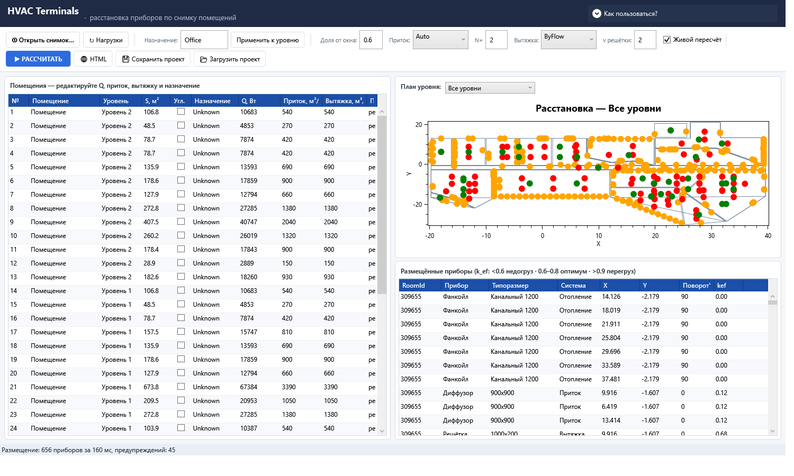
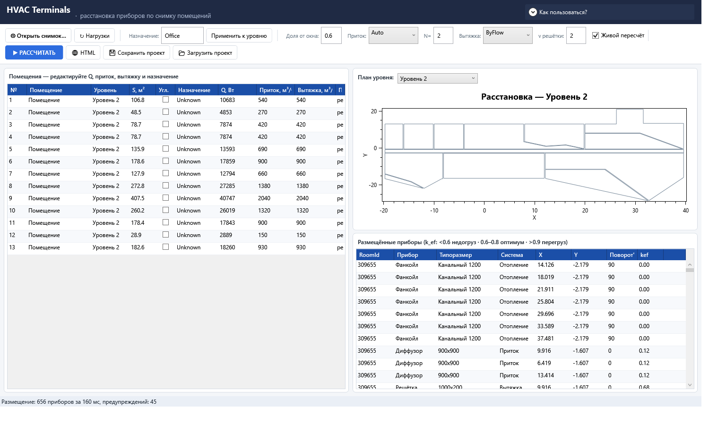

# U1.1 — Отчёт: фильтр таблицы помещений по уровню (баг-фикс)

- **Дата**: 2026-08-23
- **Статус**: выполнено, ожидает контроля
- **Карточка**: `Tasks/Активные/U1.1_Фильтр_таблицы_помещений_по_уровню_баг-ф.md`

## Что было не так

В App `src/App/ViewModels/MainViewModel.cs` сеттер `SelectedLevel` вызывал
`RoomsView.Refresh()`, но предикат `.Filter` у представления не был назначен —
`CollectionViewSource.GetDefaultView(Workspace.Rooms)` возвращал «сырое»
представление без фильтра. Выбор уровня в ComboBox «План уровня» перерисовывал
только OxyPlot-план, а таблица помещений оставалась полной.

## Что сделано

`src/App/ViewModels/MainViewModel.cs` — предикат фильтра назначается при первом
обращении к `RoomsView` (строки 31-44):

```csharp
public ICollectionView RoomsView
{
    get
    {
        if (_roomsView != null)
            return _roomsView;
        _roomsView = CollectionViewSource.GetDefaultView(Workspace.Rooms);
        // U1.1: выбор уровня в ComboBox фильтрует таблицу помещений.
        _roomsView.Filter = o => o is RoomRow row && FilterVisible(row);
        return _roomsView;
    }
}
```

При смене уровня срабатывает существующий `RoomsView.Refresh()` в сеттере
`SelectedLevel` (MainViewModel.cs:57) — повторный `.Refresh()` при каждом выборе
уровня достаточен, дополнительных правок не требуется. `FilterVisible`
(MainViewModel.cs:312-313) уже использовался командами «Применить назначение» /
«Только видимые», поэтому они продолжают работать по видимым строкам без
изменений.

### Ревит-хост

`src/Revit/UI/SnapshotPlacementWindow.xaml.cs` проверен по условию карточки:
своего `ICollectionView` стенд не держит — `RoomsGrid.ItemsSource = state.Rooms`
(сырой ребиндинг, строка 53), ComboBox уровней отсутствует
(`SnapshotPlacementWindow.xaml`). Фикс неприменим — изменений не требуется.

## Доказательства (критерии приёмки)

| # | Критерий | Результат |
|---|----------|-----------|
| 1 | сборка sln EXITCODE=0 | ✅ `dotnet build HVACLoadTerminals.sln --nologo` → «Сборка успешно завершена. Ошибок: 0» (EXITCODE 0) |
| 2 | Core.Tests baseline 74/74 | ✅ 108/108 (`не пройдено 0, пройдено 108, пропущено 0, всего 108`) — не хуже базы |
| 3 | скриншот App до/после выбора уровня | ✅ `Tasks/Отчёты/U1.1_артефакты/U1.1_before_all_levels.png` и `U1.1_after_level.png` (см. ниже) |
| 4 | grep подтверждает `.Filter =` | ✅ `src/App/ViewModels/MainViewModel.cs:41: _roomsView.Filter = o => o is RoomRow row && FilterVisible(row);` |

### Скриншоты (критерий 3)

Снимок: `%AppData%\HeatLossRevit2\data\snapshots_raw\HvackFinal\HvackFinal_v1.1.json`
(4 уровня). Флоу: открыть снимок → «▶ РАССЧИТАТЬ» → выбрать уровень в ComboBox.

| До («Все уровни») | После («Уровень 2») |
|----|-------|
|  |  |

- до: в таблице 40 строк (Уровень 1 + Уровень 2 + Уровень 3), план со всеми приборами;
- после: выбран «Уровень 2» — в таблице только 13 его комнат (колонка «Уровень»
  однородная), план перерисован под уровень.

## ASSUMPTION

Нет допущений: задание полностью соответствовало фактическому коду, ревит-хост
своей коллекции представления не имеет — проверено по исходнику.

## Открытые вопросы

Сразу после «Открыть снимок…» (до «РАССЧИТАТЬ») список уровней в ComboBox
содержит только «Все уровни» — presenter шлёт состояние без `Levels` до расчёта.
Существующее поведение не тронуто; при необходимости — отдельная карточка.

## Как проверить

1. `dotnet build HVACLoadTerminals.sln --nologo` — EXITCODE 0.
2. `dotnet test src\Core.Tests\HVACLoadTerminals.Core.Tests.csproj --no-build` — 108/108.
3. Открыть App → «Открыть снимок…» (HvackFinal_v1.1.json) → «РАССЧИТАТЬ» →
   выбрать «Уровень 2» в ComboBox «План уровня» → в таблице помещений только
   комнаты уровня, «Все уровни» → все 40.