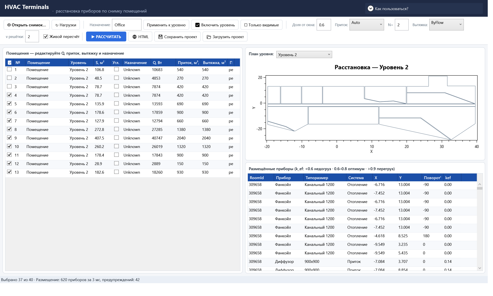

# U1.2 — Отчёт: выбор комнат — чекбокс «Включено» + расчёт выбранных

- **Дата**: 2026-08-23
- **Статус**: выполнено, ожидает контроля (статус done ставит план-раннер)
- **Карточка**: `Tasks/Активные/U1.2_Выбор_комнат_чекбокс_Включено__расчёт_вы.md`

## Что сделано

### Модель строки (`src/Infrastructure/Presentation/Rows.cs`)

`RoomRow.IsIncluded` — INPC-свойство, по умолчанию `true` (Rows.cs:16–22):

```csharp
private bool _isIncluded = true;
public bool IsIncluded
{
    get => _isIncluded;
    set { _isIncluded = value; OnPropertyChanged(nameof(IsIncluded)); }
}
```

### Presenter (`src/Infrastructure/Presentation/SnapshotWorkspacePresenter.cs`)

- `Calculate()` обрабатывает только включённые комнаты (SnapshotWorkspacePresenter.cs:204, 223).
- Все комнаты выключены → статус **«Не выбрано ни одного помещения»**, расчёт
  не падает и возвращает пустое состояние с `IsCalculation = true`
  (таблица приборов очищается) — SnapshotWorkspacePresenter.cs:204–218.
- Счётчик выбранных в статусе расчёта:
  `Выбрано N из M · Размещение: …` (SnapshotWorkspacePresenter.cs:385).
- Групповые операции (SnapshotWorkspacePresenter.cs:150–174):
  `SetIncluded(filter, included)`, `IncludeLevel(levelName)` («включить уровень»),
  `IncludeOnlyVisible(visibleFilter)` («только видимые»), `CountIncluded()`.
- Round-trip проекта сохраняет флаги автоматически: `ProjectDto.Rooms`
  сериализует `RoomRow` целиком через Newtonsoft.

### Хосты

- `src/App/MainWindow.xaml` — колонка-чекбокс «☑» первой в таблице помещений
  (`DataGridCheckBoxColumn`, `UpdateSourceTrigger=PropertyChanged`); на панели
  кнопки «☑ Включить уровень» и «☐ Только видимые».
- `src/App/ViewModels/MainViewModel.cs` — команды `IncludeLevelCommand`
  («Все уровни» → включить всё; иначе уровень из ComboBox «План уровня») и
  `IncludeOnlyVisibleCommand` (точное множество видимых строк фильтра уровня,
  MainViewModel.cs:181–190).
- `src/Revit/UI/SnapshotPlacementWindow.xaml` — та же колонка «☑» первой
  (общий presenter, изменений code-behind не потребовалось).

Живой пересчёт намеренно НЕ реагирует на переключение чекбокса: массовые
операции не должны порождать лавину пересчётов; план обновляется по
«▶ РАССЧИТАТЬ» (или любым другим live-триггером).

## Доказательства (проверка критериев приёмки)

| # | Критерий | Результат |
|---|----------|-----------|
| 1 | юнит-тест presenter «Calculate respects IsIncluded» | ✅ `Calculate_Respects_IsIncluded`: выключена комната «b» → все размещения только в «a», статус содержит «Выбрано 1 из 2» |
| 2 | round-trip тест проекта с флагами | ✅ `Project_RoundTrip_Preserves_IsIncluded_Flags`: SaveProject→LoadProject сохраняет `[true,false]`; дополнительно `Calculate_With_NoneSelected_Returns_Status_And_DoesNotThrow` (двойной вызов) и `IncludeLevel_And_IncludeOnlyVisible_Update_Selection` |
| 3 | Core.Tests ≥74 pass | ✅ baseline 74 → **78/78**: `не пройдено 0, пройдено 78, пропущено 0, всего 78` (+4 новых) |
| 4 | скриншот грида с чекбоксами | ✅ см. ниже |

Дополнительно: `dotnet build HVACLoadTerminals.sln` → EXITCODE 0 (App, Revit,
Infrastructure, Core — без ошибок; предупреждения старые, вне карточки).

Инструментальная проверка (харнесс поднимает реальное окно App c тем же
MainViewModel из AppHost DI, снимок HvackFinal_v1.1.json):

```
rooms=40 level2=13 included=37/40 devices=620
status=Выбрано 37 из 40 · Размещение: 620 приборов за 3 мс, предупреждений: 42
```

Сценарий «включено 3 из N»: сняты чекбоксы комнат 1–3 уровня 2 — в таблице
приборов отсутствуют размещения этих RoomId, счётчик в статусе 37/40.
Сценарий «все выключены» покрыт юнит-тестом (расчёт не падает, статус по карточке).

## Скриншот (критерий 4)



Уровень 2: колонка «☑» первая, комнаты 1–3 выключены (4–13 включены);
на панели кнопки «☑ Включить уровень» / «☐ Только видимые»; в статусной
строке — «Выбрано 37 из 40 · Размещение: 620 приборов…».

## Наблюдения вне скоупа карточки

При каждом `StateChanged` коллекция `Levels` пересоздается через `Clear()`,
из-за чего программно установленный `SelectedLevel` сбрасывается WPF-биндингом
в «Все уровни» (заметно только при автоматизации; пользовательский сценарий
не затронут). Предложено план-раннеру как отдельная карточка при необходимости.

## Границы

Соблюдены: изменены только файлы карточки; `.idea\`, `.opencode\`, `bin\obj`,
`TestResults\`, чужие отчёты/планы не затронуты и в коммит не включены;
карточка в `Tasks/Активные/` оставлена некоммиченной для контролёра
(по образцу U1.1).

## Коммит

Коммит `plan/U1.2` на текущей ветке: код (6 файлов), тесты, настоящий отчёт
и артефакт `Tasks/Отчёты/U1.2_артефакты/U1.2_grid_checkboxes.png`.
