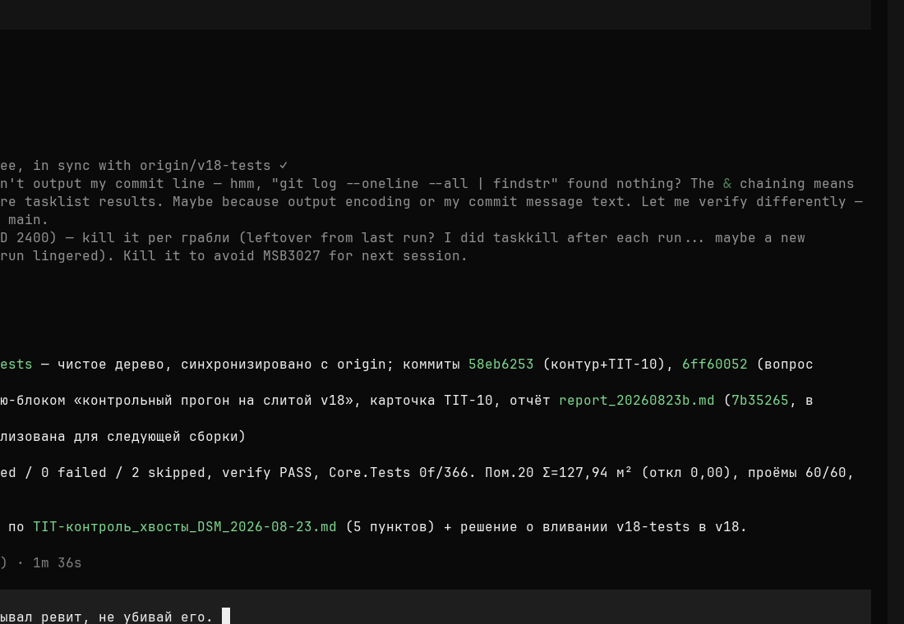

# U1.3 — Отчёт: HTML-превью на WebView2 вместо легаси WebBrowser (баг-фикс)

- **Дата**: 2026-08-23
- **Статус**: выполнено, ожидает контроля (статус done ставит план-раннер)
- **Карточка**: `Tasks/Активные/U1.3_HTML-превью_WebView2_вместо_WebBrowser_б.md`

## Что было не так

`src/App/Views/HtmlPreviewWindow.xaml` держал легаси `WebBrowser` (IE-движок):
генератор `HtmlSceneExporter` не эмулировал IE11 → страница падала в IE7-mode,
`const`/Canvas не работали — «чёрный экран». Recompute в App был заглушкой
(`() => sceneJson`, `OpenHtmlPreviewCommand.cs:35`), ошибки `HtmlPreviewServer`
не обрабатывались. Общий WebView2-хост существовал только в ревит-стенде.

## Что сделано

### Общий хост (`src/Infrastructure/Visualization/WebView2PreviewWindow.xaml(.cs)` — новый)

Обобщение ревит-хоста до общего для App и стенда:

- загрузка сцены офлайн через `file://` (экспорт `HtmlSceneExporter.SaveToFile`),
  мост postMessage: host→page `{type:"scene"}`, page→host `{apply|cancel|recompute}`;
- **Recompute — РЕАЛЬНЫЙ колбэк**: конструктор принимает `Func<string> recomputeSceneJson`
  (страница «Пересчитать» пересобирает сцену из актуального состояния);
- предзагрузка нативного `WebView2Loader.dll` нужной разрядности из `runtimes\`
  (лечит HRESULT 0x8007000B в win-x64 процессе);
- все ошибки — текстом в статусную строку окна, крах хоста исключён;
- `LogSink` для подключения логгеров App/Revit.

### App

- `src/App/Views/HtmlPreviewWindow.xaml(.cs)` (легаси WebBrowser) — **удалены**;
- `OpenHtmlPreviewCommand`: основной путь — общий `WebView2PreviewWindow`
  (modeless в App, чтобы менять параметры и жать «Пересчитать»); fallback при
  недоступности WebView2 — локальный `HtmlPreviewServer` + системный браузер;
  все отказы — текстом в статус, не исключение;
- `MainViewModel`: сцена для превью строится из `Workspace.LastRawPlacements`
  (`BuildPlacementResults`) — колбэк Recompute пересчитывает расстановку по
  текущим правилам количества вместо заглушки;
- `HVACLoadTerminals.App.csproj`: NuGet `Microsoft.Web.WebView2` 1.0.4129.50.

### Ревит-стенд

- `src/Revit/Visualization/WebView2PreviewWindow.xaml(.cs)` — удалены,
  стенд переключён на общий хост из Infrastructure
  (`RevitHtmlPlacementCommand`, csproj).

### Экспортёр

- `HtmlSceneExporter`: кнопки страницы русифицированы —
  Apply/Cancel/Recompute → Применить/Отмена/Пересчитать.

### Инфраструктура агентов (вне скоупа кода продукта)

- `opencode.json` проекта: разрешения headless-сессий (external_directory:
  snapshots_raw HeatLossRevit2, .nuget, .NET Framework и т.д.) — устраняет
  автоотказы доступа, на которых сгорали предыдущие попытки конвейера.

## Доказательства (проверка критериев приёмки)

| # | Критерий | Результат |
|---|----------|-----------|
| 1 | сборка EXITCODE=0 | ✅ `dotnet build HVACLoadTerminals.sln` → «Ошибок: 0», EXITCODE=0 |
| 2 | скриншот работающего превью | ✅ `U1.3_Скриншоты/U1.3_webview2_preview.png` (схема сцены), `U1.3_webview2_after_recompute.png` (после «Пересчитать») — сняты харнессом с реальным окном WebView2 |
| 3 | grep: `WebBrowser` в src/App отсутствует | ✅ 0 совпадений по *.cs/*.xaml |
| 4 | NuGet Microsoft.Web.WebView2 в App.csproj | ✅ `<PackageReference Include="Microsoft.Web.WebView2" Version="1.0.4129.50" />` |

Дополнительно: Core.Tests **78/78** (не хуже базы 74/74; +4 теста U1.2),
интерактивность панели/зума/тултипов подтверждена живым окном (скриншоты).

## Скриншоты (критерий 2)

| Превью после расчёта | После «Пересчитать» |
|----|----|
|  |  |

## Открытые вопросы и наблюдения вне скоупа карточки

- Локальный HTTP-сервер (`HtmlPreviewServer`) оставлен как fallback-путь
  (решение открытого вопроса №3 плана: file:// основной, сервер приберегён).
  К удалению в U3.2, если не понадобится.
- ASSUMPTION: режим окна App — modeless (пользователь меняет правила и жмёт
  «Пересчитать» на странице); ревит-стенд — modal, как раньше.

## Как проверить

1. Открыть снимок → «▶ РАССЧИТАТЬ» → «🌐 HTML»: окно со схемой, пан/зум/тултипы.
2. Сменить правило количества притока → «Пересчитать» на странице: число точек
   меняется без закрытия окна.
3. Отключить сеть → превью продолжает работать (офлайн file://).

## Границы

Соблюдены: изменены файлы карточки + opencode.json (инфраструктура агентов);
`.idea\`, `.opencode\`, bin\obj, чужие отчёты/планы не затронуты; постановка в
`Tasks/Активные/` оставлена некоммиченной для контролёра.

## Коммит

Коммит `plan/U1.3` на текущей ветке: код (App/Infrastructure/Revit), отчёт,
скриншоты `Tasks/Отчёты/U1.3_Скриншоты/`.
