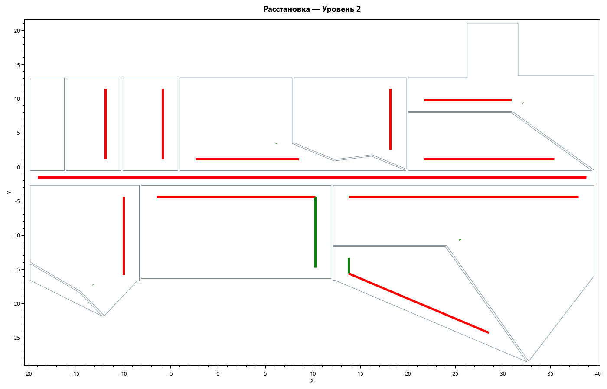
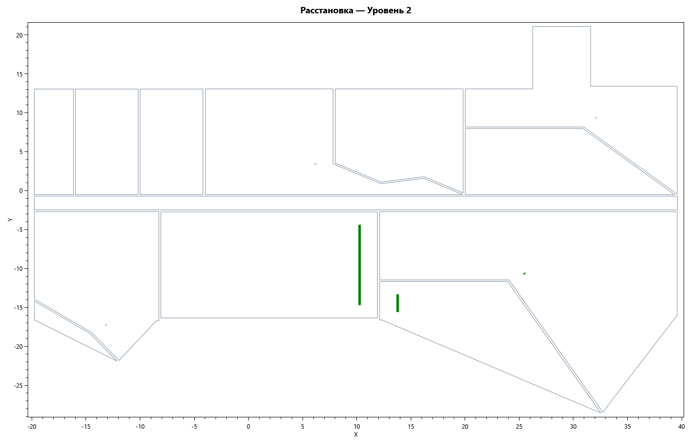

# ОТЧЁТ: U2.1 — Паттерны массовой расстановки: сторона стены + правило одиночных

- **Дата**: 2026-08-23
- **Статус**: выполнено, ожидает контроля (статус done ставит план-раннер)
- **Карточка**: `Tasks/Активные/U2.1_Паттерны_массовой_расстановки_сторона_ст.md`
- **Время**: план — не задан в карточке; факт ≈ 30 мин (17:33–18:03)

## Что было не так

`CeilingPlacementService` расставлял потолочные приборы только равномерной сеткой
по офсет-контуру; одиночный прибор всегда в центре (`CeilingPlacementService.cs:125-127`
до правки). Правило владельца «приточные вдоль длинной границы, вытяжные вдоль
короткой; отдельное правило для одиночных» в UI задать было нельзя, в проекте
(`*.hvacproj.json`) паттерны не сохранялись, на плане выбранные стороны не
показывались.

## Что сделано

### Core (`src/Core/Services/CeilingPlacementService.cs`)

- `WallPattern { CeilingGrid, LongSide, ShortSide, Explicit }`,
  `SingleRule { Center, Corner }` (аналог `single_device_orientation`);
- `CeilingPlacementOptions += Pattern, SingleRule, ExplicitSide, SpacingMm,
  StartOffsetMm` (семантика Spacing/StartOffset как в `PlacementOptions`);
- настенные режимы переиспользуют готовое ядро: рёбра офсет-контура через
  `RoomGeometryAnalyzer.GetEdges`, выбор ребра — `SelectPrimaryEdge`
  (LongSide/ShortSide → SidePreference; Explicit → CoordinateSystem);
- распределение по ребру: `StartOffsetMm` с обеих концов; `SpacingMm = 0` —
  равномерно; `SpacingMm > 0` — фиксированный шаг по центру ребра, при
  невмещении — откат к равномерному + warning;
- поворот приборов ряда — внутрь помещения (как в `TerminalPlacementService`);
- `SingleRule`: Center = центр офсет-контура (прежнее поведение), Corner =
  вершина офсет-контура, ближайшая к углу min-X/min-Y (детерминировано);
- `CeilingPlacementResult += SelectedEdge` — выбранное ребро для подсветки;
- узкая комната (офсет коллапсирует даже на половинном отступе) → warning
  «Контур слишком мал…», без исключений (общий ранний выход сохранён).

### Infrastructure/Presentation (`SnapshotWorkspacePresenter.cs`, новый `PatternEdge.cs`)

- опции раздельно для Притока и Вытяжки, дефолты владельца:
  `SupplyPattern = LongSide`, `ExhaustPattern = ShortSide`,
  `SingleDeviceRule = Center`; массивы `WallPatterns`/`SingleRules` для биндинга
  комбобоксов обоих хостов (DataContext ревит-стенда — сам presenter);
- `Calculate()` пробрасывает паттерны в `CeilingPlacementOptions` обеих систем и
  собирает `LastPatternEdges` (уровень, система, Start/End) из `SelectedEdge`;
- round-trip: `ProjectDto += SupplyPattern/ExhaustPattern/SingleRule`
  (nullable); сериализация со `StringEnumConverter` — в файле читаемые имена
  (`"SupplyPattern": "Explicit"`), старые файлы без полей дают дефолты владельца.
  Конвертер подключён в точке сериализации — Core остаётся без зависимости от
  Newtonsoft.

### App (`MainWindow.xaml`, `MainViewModel.cs`)

- тулбар: комбобокс паттерна рядом с правилом Притока и Вытяжки + «1 прибор»
  (Center/Corner); свойства-пробросы с живым пересчётом;
- OxyPlot-план (`PlotLevelCore`): подсветка выбранных рёбер толстой линией
  (5 px) цветом системы — приток красный, вытяжка зелёная; фильтр по уровню.

### Ревит-стенд (`src/Revit/UI/SnapshotPlacementWindow.xaml`)

- те же контролы (паттерн Притока, паттерн Вытяжки, «1 прибор») поверх общих
  опций presenter; добавлен недостававший комбобокс правила количества Вытяжки
  для симметрии с App.

## Доказательства (проверка критериев приёмки)

| # | Критерий | Результат |
|---|----------|-----------|
| 1 | юнит-тесты новых режимов (12×8 м воспроизводимо) | ✅ `CeilingPatternTests`: LongSide/ShortSide на прямоугольнике 12000×8000 мм (ряд на одной стороне ±20 мм, отступ ≥490 мм, размах ряда ≥10 м), Explicit=Bottom (y≈7500 мм), фиксированный шаг с откатом, Single Center (±100 мм центра) / Corner (≈(500,500)), L-образная (все точки внутри офсет-контура: ContainsPoint + MinDistanceToEdge≥490 мм), узкая 400 мм → warning без падения |
| 2 | round-trip тест паттернов | ✅ `Project_RoundTrip_Preserves_Placement_Patterns` (+ проверка строковых имён в JSON) и `Project_Legacy_File_Without_Patterns_Keeps_Owner_Defaults`; дефолты — `Pattern_Owner_Defaults_Are_LongSide_ShortSide_Center` |
| 3 | Core.Tests зелёные | ✅ `не пройдено 0, пройдено 90, пропущено 0, всего 90` (база 78 + 12 новых); сборка sln: «Ошибок: 0», EXITCODE=0 |
| 4 | скриншоты плана с подсветкой сторон | ✅ `Tasks/Отчёты/U2.1_Скриншоты/U2.1_plan_patterns_default.png` (51 ребро: красные LongSide-приток, зелёные ShortSide-вытяжка) и `U2.1_plan_supply_grid.png` (приток переведён на CeilingGrid — осталось 17 зелёных рёбер). Снято харнессом с реальным `MainViewModel`+presenter на снимке HvackFinal_v1.1.json («Уровень 2», 40 помещений, 654 прибора), рендер `OxyPlot.Wpf.PngExporter` |

Дополнительно: `Calculate_Produces_Pattern_Edges_For_Highlighting` — presenter
отдаёт рёбра обеих систем с уровнем для хостов.

## Скриншоты (критерий 4)

| Дефолт владельца: Приток=LongSide + Вытяжка=ShortSide | Приток=CeilingGrid (сравнение) |
|----|----|
|  |  |

Красные рёбра — длинные стороны (приток), зелёные — короткие (вытяжка).

## Открытые вопросы и наблюдения вне скоупа карточки

- Точки приборов на OxyPlot-плане не видны ни в базе (скриншот U1.1, тот же
  уровень), ни сейчас — pre-existing особенность `PlotLevelCore` (ScatterSeries),
  к карточке не относится; предложено отдельной карточке.
- ASSUMPTION: трактовка «Corner» — вершина офсет-контура, ближайшая к углу
  min-X/min-Y (детерминированно, покрыто тестом); «Explicit» — явная сторона
  габарита через `CoordinateSystem` (Bottom/Right/Top/Left), в UI пока не
  выставляется (доступно из кода/API).
- Старые `*.hvacproj.json` без полей паттернов после загрузки получают дефолты
  владельца (LongSide/ShortSide/Center) — пересчёт изменит картину относительно
  прежней сетки; зафиксировано тестом как ожидаемое поведение.
- Ревит-стенд не подписывается на INPC presenter (как и до карточки) — новые
  комбобоксы работают в том же режиме «прочитал при открытии/расчёте».

## Как проверить

```
dotnet build HVACLoadTerminals.sln -v q        # Ошибок: 0
dotnet test src\Core.Tests\...csproj           # 90/90
```

UI: открыть снимок → «▶ РАССЧИТАТЬ»: на плане приточные стороны красные,
вытяжные зелёные; сменить «Приток: LongSide → CeilingGrid» — красные рёбра
гаснут (живой пересчёт); «Сохранить проект» → в JSON поля
SupplyPattern/ExhaustPattern/SingleRule читаемыми именами.

## Границы

Соблюдены: изменены только файлы карточки (Core/Core.Tests/Infrastructure/App/
Revit-тулбар); `.idea\`, `.opencode\`, bin\obj, TestResults\, чужие отчёты/планы
и постановка `Tasks/Активные/` в коммит не включены; субагенты не создавались.

## Коммит

Коммит `plan/U2.1` на текущей ветке: код, тесты, отчёт и скриншоты
`Tasks/Отчёты/U2.1_Скриншоты/`.
