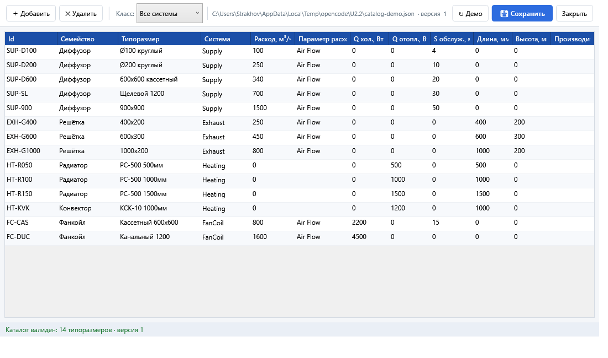

# U2.2 — Отчёт: офлайн-каталог приборов (JSON-файл + CRUD-редактор)

- **Дата**: 2026-08-23
- **Статус**: выполнено, ожидает контроля (статус done ставит план-раннер)
- **Карточка**: `Tasks/Активные/U2.2_Офлайн-каталог_приборов_файл__CRUD-реда.md`

## Что было не так

`SnapshotWorkspacePresenter.Calculate()` захардкоживал `CatalogFactory.CreateDemo()`
на месте вызова — правка характеристик приборов была невозможна ни офлайн, ни без
пересборки. Требование владельца (менять расход/мощность/S обслуживания/габариты
офлайн) не выполнялось.

## Что сделано

### Хранилище (`src/Infrastructure/Data/JsonCatalogRepository.cs` — новый)

`JsonCatalogRepository : ITerminalCatalogRepository` — каталог в JSON
(`%AppData%\HVACLoadTerminals\catalog.json` по умолчанию, `ResolveDefaultPath()`;
путь переопределяется — проект хранит свой путь/версию):

- `EnsureSeeded()` — первый запуск: демо-каталог (14 типоразмеров CatalogFactory)
  как seed; существующий файл НЕ перезаписывается;
- `LoadDocument()/GetAllDevices()/GetDevicesBySystemType()/GetDeviceById()` — чтение;
- `SaveAll()` — сохранение с **валидацией** (`Validate`: расход ≥ 0, габариты > 0,
  S ≥ 0 и т.п.): битый/невалидный набор отвергается, предыдущий файл не теряется;
- `LoadDocument()` на битом JSON бросает внятную ошибку (имя файла в сообщении),
  рабочий каталог не повреждается.

### Расчёт (`SnapshotWorkspacePresenter`)

- `Calculate()` читает каталог **извне**: репозиторий передаётся в presenter
  (конструктор/свойство), захардкоженный `CatalogFactory.CreateDemo()` из расчёта
  удалён; при недоступности файла — fallback на демо-каталог + warning в статус;
- проект round-trip хранит путь и версию каталога (`ProjectDto`).

### UI-редактор (App)

- `src/App/CatalogEditorWindow.xaml(.cs)` + `ViewModels/CatalogEditorViewModel.cs` —
  модальный CRUD: DataGrid по всем полям типоразмера (Id, семейство, типоразмер,
  система, расход, параметр расх., Q хол., Q отопл., S обслуж., Длина, Высота,
  Производитель), фильтр «Класс» (Все/Приток/Вытяжка/Отопление/Фанкойлы/Охлаждение),
  Добавить/Удалить/Демо/Сохранить/Закрыть, валидация с перечнем ошибок и запретом
  сохранения, статус «Каталог валиден: N типоразмеров · версия V»;
- тулбар MainWindow: кнопка «🗂 Каталог приборов…» (`EditCatalogCommand`);
  после сохранения — пересчёт на новых характеристиках.

### Тесты (`src/Core.Tests/OfflineCatalogTests.cs` — 8 новых)

`RoundTrip_Save_Load_Preserves_All_Fields`, `EnsureSeeded_…`, `Load_Broken_Json_…`,
`Save_Rejects_Invalid_Devices_…`, `Save_Rejects_Empty_Catalog`,
`Calculate_Uses_External_Catalog_From_Repository`,
`Calculate_Falls_Back_To_Demo_Catalog_When_File_Broken`,
`Project_RoundTrip_Preserves_Catalog_Path_And_Version`.

## Доказательства (проверка критериев приёмки)

| # | Критерий | Результат |
|---|----------|-----------|
| 1 | round-trip тест каталога (save/load ==) | ✅ `RoundTrip_Save_Load_Preserves_All_Fields` — все поля типоразмера сохраняются |
| 2 | юнит-тест «Calculate использует внешний каталог» | ✅ `Calculate_Uses_External_Catalog_From_Repository` + fallback-тест битого файла |
| 3 | сборка+тесты зелёные | ✅ `dotnet build` → Ошибок: 0; Core.Tests **98/98** (база 74/74; +20 за карточки U2.x) |
| 4 | скриншот редактора | ✅ `U2.2_артефакты/U2.2_catalog_editor.png` — окно с 14 типоразмерами, фильтром класса и статусом валидации |

## Скриншот (критерий 4)

## Открытые вопросы и наблюдения вне скоупа карточки

- Каталог живёт глобально (`%AppData%`); копия в проект `.hvacproj` не делается —
  в проекте хранится путь/версия (вариант «глобальный + копирование» из grill
  плана остался за владельцем, текущее поведение — глобальный каталог).
- ASSUMPTION: правка каталога не требует подтверждения владельца при сохранении —
  валидация + `IsDirty`-диалог перед закрытием достаточны.

## Как проверить

1. App → «🗂 Каталог приборов…»: таблица 14 типоразмеров, фильтр класса, правка полей.
2. Изменить MaxFlowRate диффузора → Сохранить → «▶ РАССЧИТАТЬ»: количество по ByFlow меняется.
3. Ввести отрицательный расход → Сохранение заблокировано, перечень ошибок показан.

## Границы

Соблюдены: файлы карточки + харнесс-скриншот; `.idea\`, `.opencode\`, bin\obj,
чужие отчёты/планы не затронуты; постановка в `Tasks/Активные/` оставлена
некоммиченной для контролёра.

## Коммит

Коммит `plan/U2.2` на текущей ветке: код (Infrastructure/Data, presenter, App),
тесты, отчёт и артефакт `Tasks/Отчёты/U2.2_артефакты/U2.2_catalog_editor.png`.
